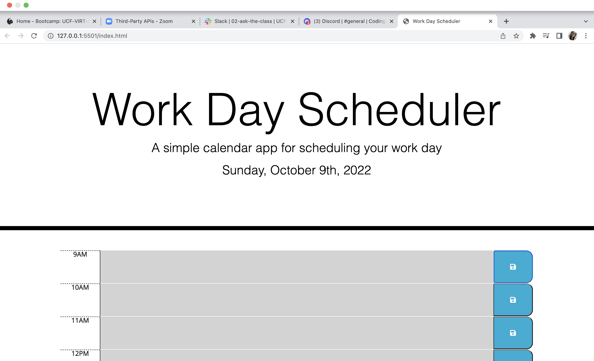

README Frame

# <Your-Project-Title>

## Description

The point of this homework assignment was to practice developing HTML content and Javascript code using jQuery and bootstrap. This web application is a day scheduler by the hour and saves inputted events to the page and the local storage. The problem solved in this assignment is the timeblocks were created and the accompanying JavaScript functions were linked in order to display an hourly schedule with inputs to store events. 

## Installation

N/A

## Usage

Below is a screenshot and link to the deployed application. 

[This is the link to the Work Day Scheduler.](https://jalmand2.github.io/challenge-five/)

## License

MIT License 

